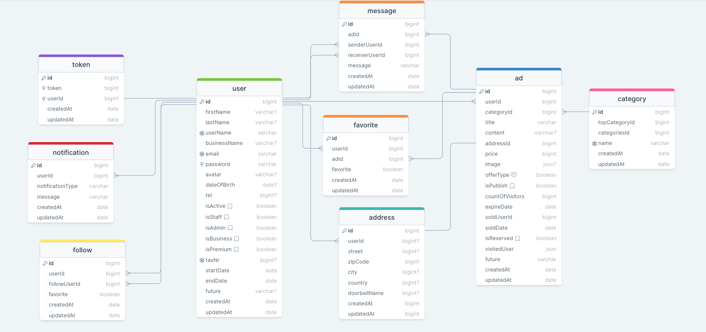

# Keller Store

### ERD:



### Folder/File Structure:

```
Backend
├─ src
│  ├─ configs
│  │  ├─ dbConnection.js
│  │  └─ swagger.json
│  ├─ controllers
│  │  ├─ ad.js
│  │  ├─ address.js
│  │  ├─ auth.js
│  │  ├─ category.js
│  │  ├─ favorite.js
│  │  ├─ follow.js
│  │  ├─ message.js
│  │  ├─ notification.js
│  │  ├─ token.js
│  │  └─ user.js
│  ├─ helpers
│  │  ├─ dateToLocaleString.js
│  │  ├─ passwordEncrypt.js
│  │  ├─ sendMail.js
│  │  └─ sync.js
│  ├─ middlewares
│  │  ├─ authentication.js
│  │  ├─ errorHandler.js
│  │  ├─ findSearchSortPage.js
│  │  ├─ logger.js
│  │  ├─ permissions.js
│  │  └─ upload.js
│  └─ models
│     ├─ ad.js
│     ├─ address.js
│     ├─ category.js
│     ├─ favorite.js
│     ├─ follow.js
│     ├─ message.js
│     ├─ notification.js
│     ├─ token.js
│     └─ user.js
├─ .gitignore
├─ envStart
├─ erdKellerStore.png
├─ index.js
├─ package.json
├─ readme.md
└─ swaggerAutogen.js
```